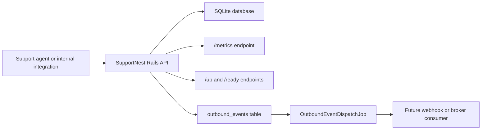

# Container Diagram

```mermaid
flowchart LR
  Client["Support agent or internal integration"] --> API["SupportNest Rails API"]
  API --> DB["SQLite database"]
  API --> Metrics["/metrics endpoint"]
  API --> Health["/up and /ready endpoints"]
  API --> Outbox["outbound_events table"]
  Outbox --> Job["OutboundEventDispatchJob"]
  Job --> Downstream["Future webhook or broker consumer"]
```
