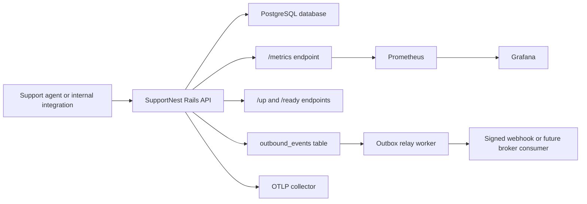

# Container Diagram

```mermaid
flowchart LR
  Client["Support agent or internal integration"] --> API["SupportNest Rails API"]
  API --> DB["PostgreSQL database"]
  API --> Metrics["/metrics endpoint"]
  API --> Health["/up and /ready endpoints"]
  API --> Outbox["outbound_events table"]
  Outbox --> Relay["Outbox relay worker"]
  Relay --> Downstream["Signed webhook or future broker consumer"]
  Metrics --> Prometheus["Prometheus"]
  API --> OTel["OTLP collector"]
  Prometheus --> Grafana["Grafana"]
```
